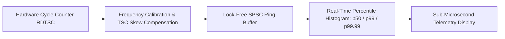

# ⏱️ Timertia — Nanosecond High-Precision Inertial Chronometry & Benchmarks

A nanosecond-precision benchmarking harness and lock-free timekeeper leveraging direct x86 `RDTSC` / ARM `CNTVCT_EL0` cycle counters with zero syscall overhead for ultra-low latency profiling.

---

## 🏛️ Chronometry Pipeline

---

### 👨‍💻 Engineering Syndicate & Authors
- **Жирняк (Jirnyak)** — Low-Level Hardware Systems & Performance Engineering.  
  GitHub: [@Jirnyak](https://github.com/Jirnyak)
- **Адольф Петушков (Adolf Petushkov)** — High-Concurrency Systems & Benchmark Architecture.  
  GitHub: [@marko1olo](https://github.com/marko1olo)
